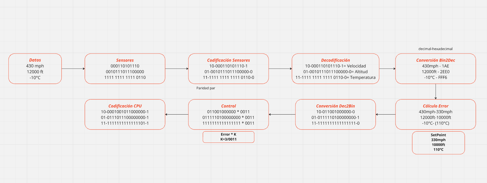

# Diagrama de bloques

# Ejemplos 

Con esta actividad puedo concluir lo necesario que es un diagrama de bloques a la hora de resolver problemas con números binarios. A demás de aplicar operaciones como conversiones y multiplicaciones. 
La actividad me permitió aplicar lo visto en clase en un problema práctico relacionado con lo que estudio.